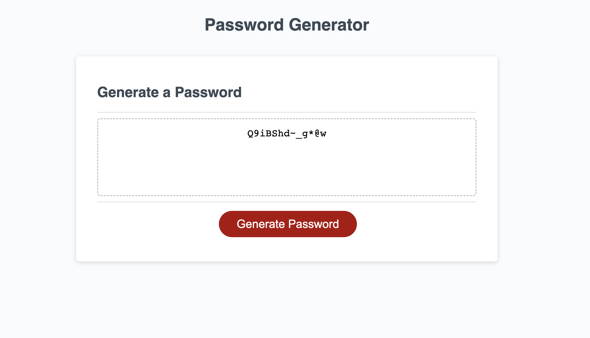

##password-maker

## Description

when visiting the site you will see a password generator that gives options on the password a user wants 
While building this project I learned to:

- placing values and variables 
- having a random charater generator in my JavaScript 
- attaching strings so that a user has options
- a lopp that lets user know is their input is valid or not

The original User Story and Acceptance Criteria were as follows:

### User Story

```
AS AN employee with access to sensitive data
I WANT to randomly generate a password that meets certain criteria
SO THAT I can create a strong password that provides greater security
```

### Acceptance Criteria

```
GIVEN I need a new, secure password
WHEN I click the button to generate a password
THEN I am presented with a series of prompts for password criteria
WHEN prompted for password criteria
THEN I select which criteria to include in the password
WHEN prompted for the length of the password
THEN I choose a length of at least 8 characters and no more than 128 characters
WHEN asked for character types to include in the password
THEN I confirm whether or not to include lowercase, uppercase, numeric, and/or special characters
WHEN I answer each prompt
THEN my input should be validated and at least one character type should be selected
WHEN all prompts are answered
THEN a password is generated that matches the selected criteria
WHEN the password is generated
THEN the password is either displayed in an alert or written to the page
```

## Link

To see the deployed site, refer to: [Password Maker](https://01magdalenawild.github.io/password-maker/).

## Screenshot of my deployed site


